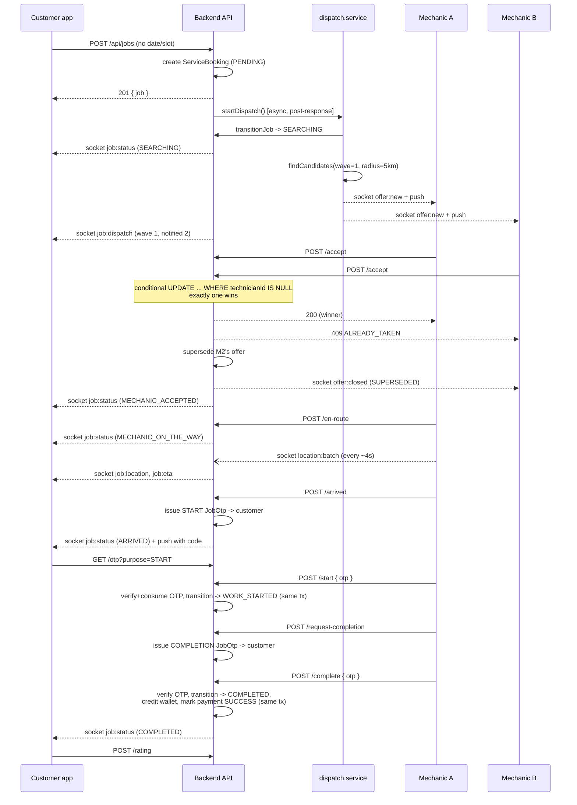

# Emergency Breakdown Dispatch — System Documentation

Real-time instant-dispatch workflow layered onto the existing Doorstep
Services module. Covers architecture, the API/socket contracts, security and
performance review, and the deployment checklist.

Related: [EMERGENCY_DISPATCH_E2E_RUNBOOK.md](./EMERGENCY_DISPATCH_E2E_RUNBOOK.md)
for running the automated test suite against an isolated environment.

---

## 1. Architecture

### 1.1 Design decision: extend `ServiceBooking`, don't fork it

An emergency job **is** a `ServiceBooking` with `isEmergency = true`. It was
not modeled as a separate `Job` table, because everything a scheduled booking
already has — payment, invoice, review, chat, images, admin tooling, the
`BookingStatus` enum, settlement — applies unchanged to an emergency job; only
the *path to get there* differs (instant dispatch vs. slot reservation) and a
handful of *new* concerns are genuinely new (dispatch offers, encrypted OTPs,
live GPS trail, masked calls). Those became four new tables
(`JobDispatchOffer`, `JobOtp`, `JobLocationPing`, `CallSession`) that hang off
`ServiceBooking`, plus new columns on `ServiceBooking` itself
(`isEmergency`, `jobLat/jobLng`, dispatch/timeline/tracking fields).

`scheduledDate`/`timeSlotId` became nullable rather than being removed —
scheduled bookings still require both (enforced in `service.controller.ts`'s
`createBooking`), emergency jobs require neither (enforced in
`job.controller.ts`'s `createEmergencyJob`, which explicitly rejects a
request that includes either field).

### 1.2 Module map

```
apps/backend/src/
├── controllers/
│   ├── job.controller.ts          Customer + mechanic emergency-job API
│   └── jobAdmin.controller.ts     Admin live-ops API
├── services/
│   ├── dispatch.service.ts        Wave fan-out, accept race, expiry
│   ├── jobState.ts                State machine + transition transaction
│   ├── jobOtp.service.ts          Encrypted OTP issue/verify
│   ├── tracking.service.ts        GPS ingestion, ETA/route throttling
│   ├── routing.service.ts         Google Directions + haversine fallback
│   ├── call.service.ts            Exotel masked calling
│   └── payment.service.ts         (existing) COD-only payment policy
├── realtime/
│   ├── gateway.ts                 Socket.IO server, auth, rooms, authz
│   └── events.ts                  Single source of truth for event names/payloads
├── jobs/
│   └── sweeper.ts                 Background correctness guarantees (§1.5)
└── utils/
    └── jobCrypto.ts                AES-256-GCM OTP encryption

apps/mobile/src/screens/services/
├── EmergencyRequestScreen.tsx     Instant booking (no date/slot)
└── EmergencyTrackingScreen.tsx    Live status, map, OTP, rating

apps/mechanic/src/
├── screens/OfferInboxScreen.tsx   Live offer feed, accept/decline
├── screens/EmergencyJobScreen.tsx Job lifecycle, OTP entry, photos
└── services/jobLocation.ts        Background GPS (expo-task-manager)

apps/admin/src/pages/services/LiveOps.tsx   Live-ops board

packages/shared/src/api/
├── jobService.ts                  REST client (customer/mechanic/admin)
├── realtime.ts                    Socket.IO client wrapper (RN)
└── realtimeEvents.ts              Client-side mirror of realtime/events.ts
```

### 1.3 Request flow (happy path)



### 1.4 Dispatch: wave fan-out and the accept race

`dispatch.service.ts` is the core of the system. Model: **broadcast auction
per wave**, not sequential offers.

- Wave *N* offers the job to every eligible mechanic within
  `DISPATCH_WAVE_RADII_KM[N-1]` km who has not already been offered it
  (`JobDispatchOffer` has `@@unique([bookingId, technicianId])`).
- All mechanics in a wave are rung **simultaneously**; the first to accept
  wins. If nobody accepts before `DISPATCH_OFFER_TTL_SECONDS`, wave *N+1*
  fires at the next (larger) radius. If all waves are exhausted, the job
  becomes `NO_MECHANIC_FOUND` — a **non-terminal** state (distinct from
  `CANCELLED`): an admin can still assign manually, or the customer can
  retry (`POST /jobs/:id/retry`), which resets the wave counter and clears
  prior offers so previously-declined mechanics become eligible again.

**Exactly-one-winner guarantee.** `acceptOffer` (dispatch.service.ts) claims
the booking with:

```ts
prisma.serviceBooking.updateMany({
  where: { id: bookingId, status: 'SEARCHING', technicianId: null },
  data: { technicianId, ... },
});
```

Postgres serializes concurrent `UPDATE`s against the same row; of *N*
simultaneous accepts, exactly one observes `count === 1`. There is no
external lock (no Redis mutex, no advisory lock) — the database row itself
is the lock. The `e2e-dispatch-test.ts` harness fires two real concurrent
HTTP requests and asserts this property under actual network concurrency,
not just at the SQL layer.

**Candidate selection** (`findCandidates`): a bounding-box Postgres query
(cheap, indexed on `isOnline, isActive, status` and `lastLocationAt`)
narrowed to exact Haversine distance in application code. No PostGIS at this
scale — see `geocoding.service.ts`'s `haversineKm`. Ranked nearest-first,
rating as tiebreak; capped at `DISPATCH_MAX_PER_WAVE`. A mechanic already
holding a live job (any `ACTIVE_JOB_STATUSES` status) is excluded —
`DISPATCH_MAX_CONCURRENT_JOBS` (default 1) enforces "no queueing" for
emergency work.

### 1.5 The sweeper: why nothing gets stuck

In-process `setTimeout` calls advance dispatch waves for low latency, but a
timer is **not** the correctness guarantee — a redeploy or crash mid-dispatch
would lose it. `jobs/sweeper.ts` runs three independent, idempotent sweeps:

| Sweep | Cadence | Guarantees |
|---|---|---|
| `dispatch` | 10s | Expires lapsed offers; advances any `SEARCHING` job with zero open offers and no active timer |
| `presence` | 60s | Marks a mechanic offline if their GPS has gone silent 3× the staleness window (skips anyone on a live job) |
| `retention` | 60min | Prunes GPS breadcrumbs past retention and OTPs past their grace period |

This is what makes the in-process timer an *optimization*, not a
*dependency* — kill the process at any point mid-dispatch and the next
sweeper tick (≤10s later) picks the job up.

### 1.6 State machine

`services/jobState.ts` owns every transition. `transitionJob()`:

1. Reads current status, optionally asserts `expectedFrom`.
2. Same-status calls succeed as a no-op (idempotent retries from a flaky
   mobile network don't error).
3. Validates the transition against `BASE_TRANSITIONS`.
4. **OTP-gated transitions** (`WORK_STARTED`, `COMPLETED`) require
   `otpVerified: true` or `adminOverride: true` — no other code path can
   produce them. This is enforced at the state-machine layer, not just in
   the controller, so a future new caller can't accidentally bypass it.
5. Claims the row with a conditional `updateMany` (same
   compare-and-swap pattern as the accept race) — closes the door on
   concurrent duplicate transitions (e.g. a retried mobile request).
6. Writes `BookingStatusHistory` in the same transaction.
7. Broadcasts over the socket **only after commit** — a rolled-back
   transaction can never be observed by a client.

```
PENDING → SEARCHING → MECHANIC_ACCEPTED → MECHANIC_ON_THE_WAY → ARRIVED
                ↓                                                  ↓
      NO_MECHANIC_FOUND                              WORK_STARTED (OTP-gated)
                ↓                                                  ↓
        (retry) SEARCHING                              COMPLETED (OTP-gated)

  MECHANIC_ASSIGNED (admin manual path) → MECHANIC_ACCEPTED → …
  any non-terminal → CANCELLED
```

### 1.7 Live tracking pipeline

```
mechanic app --(batch, ~4s)--> ingestPings()
                                    │
                          JobLocationPing rows (raw trail)
                                    │
                    ServiceTechnician.currentLat/Lng (latest fix)
                                    │
              ServiceBooking.distanceTravelledKm (incremental rollup)
                                    │
       job room: JOB_LOCATION (every ping) + JOB_ETA (throttled)
                                    │
                   admin live map: ADMIN_MECHANIC_LOCATION
```

- **Batched, not per-fix**: the mechanic app buffers locally
  (`jobLocation.ts`) and flushes every ~4s over the socket, with an HTTP
  fallback (`POST /jobs/:id/location`) if the socket is down. A dead
  connection just grows the buffer (capped at 300 fixes / ~20 min); the next
  successful flush sends the backlog in device-capture order
  (`recordedAt`, not arrival order), so a tunnel or dead signal produces a
  gap-filled trail on reconnect instead of losing minutes of track.
- **Throttled routing**: a Directions API call per GPS fix would be ~900
  calls/hour per active job. `tracking.service.ts` recomputes the route/ETA
  at most once per `TRACKING_ROUTE_REFRESH_SECONDS` (default 25s); position
  markers still update at full ping rate, so the dot moves smoothly while
  the ETA number updates periodically. `routing.service.ts` falls back to a
  Haversine + pessimistic-urban-speed estimate when Directions is
  unavailable — the response always carries `source: 'directions' |
  'haversine'` so the UI can be honest about precision.
- **Jitter rejection**: moves under `TRACKING_MIN_MOVE_METERS` are stored
  (for the trail) but excluded from `distanceTravelledKm`, so a mechanic
  parked with GPS drift doesn't accrue phantom kilometres — a figure shown
  to admins and a plausible future reimbursement input.

### 1.8 OTP security model

`utils/jobCrypto.ts` + `services/jobOtp.service.ts`. Threat model: a
mechanic marking work started/completed without the customer physically
present and consenting — a billing dispute for completion, a stranger's
vehicle being touched without consent for start.

- Codes are **AES-256-GCM encrypted at rest** (`JobOtp.codeEnc`), never
  plaintext — reversible (not hashed) because the customer has to *read*
  their own code, which a one-way hash makes impossible. Key is either
  `JOB_OTP_SECRET` or derived from `JWT_SECRET` via HKDF (domain-separated)
  if unset, so the feature works on an existing deployment before ops
  provisions a dedicated secret.
- **Single-use**: `consumedAt` is set inside the same transaction as the
  status transition it authorizes (`verifyAndConsumeOtp` takes the caller's
  `tx`) — a replayed request cannot re-run the transition, and a code can
  never be spent without its transition committing (or vice versa).
- **Attempt-limited**: `attempts` is incremented with a conditional
  `updateMany` *before* the comparison, so two concurrent guesses cannot
  both slip under `JOB_OTP_MAX_ATTEMPTS` (default 5).
- **Constant-time comparison** (`timingSafeEqualStr`) — a plain `===`
  leaks the correct prefix through response timing.
- **Never reaches the wrong party**: the code is delivered to the customer
  only, via `secureData` on the push/socket notification (never in
  title/body, which render on a lock screen) — `getJobOtpForCustomer`
  explicitly 403s a mechanic who tries to read it, and the admin job-detail
  endpoint selects OTP metadata only, never `codeEnc`.
- **Legacy-path guards**: the pre-existing scheduled-booking status
  endpoints (`service.controller.ts`) share the same `BookingStatus` enum
  and table. Without an explicit `isEmergency` check, a mechanic could reach
  `WORK_STARTED`/`COMPLETED` on an *emergency* job through those endpoints
  with **no OTP at all** (the legacy flow's `ARRIVED → WORK_STARTED` has no
  gate, and the legacy completion OTP is a separate plaintext field). Every
  legacy technician/admin mutation endpoint now refuses an `isEmergency`
  booking with a 400 pointing at the correct `/api/jobs/*` endpoint instead.

### 1.9 Call privacy

`call.service.ts`. `CONTACT_OPEN_STATUSES` = `MECHANIC_ACCEPTED` through
`WORK_STARTED` — before acceptance there's no counterparty yet; after
completion the relationship is over. Masking uses Exotel Connect: the
platform calls the requester's own handset first, then bridges to the
counterparty through a shared virtual number — **neither leg ever sees the
other's real number**, and no endpoint in this codebase can return a raw
phone number to anything but an admin. When Exotel credentials are absent,
the endpoint returns `503 CALLING_UNAVAILABLE` — there is deliberately no
`tel:`-link fallback, because that would silently convert a privacy feature
into a leak the first time config is missing.

---

## 2. API Reference

Base path: `/api/jobs`. All authenticated routes take `Authorization: Bearer
<JWT>`. Every response error is `{ error: string, code?: string }` — clients
should switch on `code`, not parse `error` text.

### 2.1 Customer

| Method & Path | Description |
|---|---|
| `POST /jobs` | Create + instantly dispatch an emergency job. Rejects `scheduledDate`/`timeSlotId` with `400 NOT_SCHEDULABLE`. Rate-limited to 5 / 10min per account. |
| `GET /jobs/active` | The caller's current in-flight emergency job, or `null`. |
| `GET /jobs/:id` | Full job detail, projected by viewer (customer/mechanic/admin — see §1.8 privacy notes). |
| `GET /jobs/:id/otp?purpose=START\|COMPLETION` | Customer-only; auto-issues a code if none is live. |
| `POST /jobs/:id/cancel` | `{ reason? }`. Blocked once `WORK_STARTED`. |
| `POST /jobs/:id/retry` | Re-dispatch a `NO_MECHANIC_FOUND`/`REJECTED` job from wave 1. |
| `GET /jobs/:id/trail` | GPS breadcrumb history. |
| `POST /jobs/:id/rating` | `{ rating, comment? }`, multipart `file` optional. One per job. |
| `POST /jobs/:id/call` | Places a masked call to the counterparty. Rate-limited to 10 / 15min. |
| `GET /jobs/:id/photos` | Metadata only (bytes via the existing `/services/bookings/images/:id/file`). |
| `POST /jobs/:id/photos` | Multipart `file` + `type` (`ISSUE`/`BEFORE`/`DURING`/`AFTER`/`ADDITIONAL_WORK`/`FEEDBACK`), optional `lat`/`lng`/`capturedAt`. |

### 2.2 Mechanic

| Method & Path | Description |
|---|---|
| `GET /jobs/offers` | This mechanic's live (unexpired, still-`SEARCHING`) offers. |
| `POST /jobs/:id/accept` | Wins the job or `409 ALREADY_TAKEN`/`410 OFFER_EXPIRED`. |
| `POST /jobs/:id/decline` | `{ reason? }`. |
| `POST /jobs/:id/en-route` | → `MECHANIC_ON_THE_WAY`. |
| `POST /jobs/:id/arrived` | → `ARRIVED`; auto-issues the START OTP to the customer. |
| `POST /jobs/:id/start` | `{ otp }` → `WORK_STARTED`, OTP-gated. |
| `POST /jobs/:id/request-completion` | Issues the COMPLETION OTP to the customer. |
| `POST /jobs/:id/complete` | `{ otp }` → `COMPLETED`, OTP-gated; credits wallet + marks payment `SUCCESS` in the same transaction. |
| `POST /jobs/:id/location` | HTTP fallback for the socket location batch: `{ pings: [...] }`. |

### 2.3 Admin (`ADMIN`/`SUPER_ADMIN`/`OPERATIONS_MANAGER`, some read-only for `CUSTOMER_SUPPORT`/`FINANCE_MANAGER`)

| Method & Path | Description |
|---|---|
| `GET /jobs/admin/live` | Live-ops board: all active jobs + online mechanics + aggregate stats, with a computed `alert` level per job. |
| `GET /jobs/admin/:id` | Full detail incl. dispatch offer history, OTP metadata (never codes), call sessions, computed durations. |
| `GET /jobs/admin/metrics?hours=24` | Fill rate, p50/p90/p99 time-to-accept, offer-outcome breakdown, wave distribution. |
| `POST /jobs/admin/:id/assign` | `{ technicianId }`. Manual assignment; closes any open offers. |
| `POST /jobs/admin/:id/redispatch` | Resets and restarts dispatch. |
| `POST /jobs/admin/:id/force-status` | `{ status, reason }` (reason required, ≥5 chars). Audited; never fabricates `verifiedByCustomer`. |

### 2.4 Webhook

| Method & Path | Description |
|---|---|
| `POST /jobs/call-status?token=<EXOTEL_API_TOKEN>` | Exotel call-status callback. Constant-time token check; always returns 200. |

---

## 3. Socket.IO Events

Single source of truth: `apps/backend/src/realtime/events.ts` (mirrored,
without the backend dependency tree, in
`packages/shared/src/api/realtimeEvents.ts` — the two **must** stay in sync
by hand; there is no build step generating one from the other).

**Connection**: `io(origin, { path: '/socket.io', auth: { token } })`. Auth
mirrors REST (`utils/jwt.ts` + a DB re-resolution of the user, so a
deleted/demoted account's socket is rejected the same way an expired REST
token is) — plus a 5-minute re-check timer for long-lived connections.

**Rooms** (auto-joined on connect, or joined on demand): `user:<userId>`,
`tech:<technicianId>`, `job:<bookingId>` (via `job:subscribe`, authorized —
customer owner, assigned mechanic, a mechanic holding an open offer, or
admin), `admins`, `admin:live-map` (opt-in).

| Direction | Event | Payload | Notes |
|---|---|---|---|
| C→S | `job:subscribe` / `job:unsubscribe` | `{ bookingId }` | Ack `{ ok, error? }` |
| C→S | `location:batch` | `{ bookingId, pings: PingInput[] }` | Mechanic only; ack echoes accepted/rejected counts |
| C→S | `admin:watch-live-map` / `unwatch` | — | Admin-role only |
| S→C | `ready` | `{ userId, role, technicianId, trackingIntervalSeconds, serverTime }` | Sent once per connection |
| S→C | `job:status` | `JobStatusEvent` | Every real status change (not same-status no-ops) |
| S→C | `job:timeline` | `JobTimelineEvent` | Full timeline, sent alongside every `job:status` |
| S→C | `job:location` | `JobLocationEvent` | Highest-frequency event (~1 per 4s while a job is live) |
| S→C | `job:eta` | `JobEtaEvent` | Throttled to ≤1 per `TRACKING_ROUTE_REFRESH_SECONDS` |
| S→C | `job:dispatch` | `JobDispatchEvent` | Wave progress while `SEARCHING` |
| S→C | `job:otp` | `JobOtpEvent` | Room-wide (no code); the code itself arrives only via the customer's own `notification` event |
| S→C | `job:photo` | `JobPhotoEvent` | On upload |
| S→C | `offer:new` | `OfferEvent` | To the offered mechanic's `tech:` room only |
| S→C | `offer:closed` | `OfferClosedEvent` | reason: `EXPIRED\|SUPERSEDED\|CANCELLED\|DECLINED` |
| S→C | `notification` | `NotificationEvent` | Mirrors every push; `data.otp` present only on the customer's own OTP notifications |
| S→C | `admin:mechanic-location` / `admin:job-update` | — | `admin:live-map` room only |

---

## 4. Security Review

| Area | Finding / Mitigation |
|---|---|
| **OTP gate integrity** | Enforced at the state-machine layer (`jobState.ts`'s `OTP_GATED`), not just per-controller — see §1.8. Legacy scheduled-booking endpoints explicitly refuse `isEmergency` bookings (4 call sites patched: `updateMyBookingStatus`, `generateBookingCompletionOtp`, `assignTechnician`, `updateAdminBookingStatus`). |
| **Phone number exposure** | `serializeJob()` in `job.controller.ts` is the single job serializer; strips phone numbers by default and reveals them only in the explicit admin branch. Pre-acceptance offers carry `area` (city+pincode) only, never the precise pin or customer name — verified in the E2E suite. |
| **OTP brute force** | Per-code attempt cap (5, DB-enforced via conditional UPDATE) + per-account rate limit (30 verification attempts / 10min) + expiry (15min default) + constant-time compare. |
| **Dispatch spam / DoS against the mechanic fleet** | `POST /jobs` and `/jobs/:id/retry` share a 5-per-10-minutes-per-account limiter — each call can ring up to `DISPATCH_MAX_PER_WAVE` mechanics. |
| **Call abuse** | 10 calls / 15 min per account; every attempt (including failures) writes a `CallSession` row before the provider call, so abuse is visible in the data even when the provider leg fails. |
| **Masked-calling fallback** | No `tel:`-link fallback when Exotel is unconfigured — feature reports `503` rather than silently exposing numbers. |
| **Race conditions** | Accept race and every status transition use conditional `updateMany` compare-and-swap, not read-then-write. Exercised under real concurrent HTTP load in the E2E suite. |
| **Socket authorization** | Rooms are the authz boundary; `job:subscribe` re-checks DB ownership per call, not just at connect time. Long-lived sockets are re-validated against the DB every 5 minutes (role/deletion changes take effect without waiting for reconnect). |
| **Admin override audit trail** | `force-status` requires a ≥5-character reason, writes to `AuditLog`, and deliberately never sets `verifiedByCustomer`/`*OtpVerifiedAt` — an overridden job remains forever distinguishable from a customer-verified one. |
| **Idempotency / replay** | Every mutating transition is safe to retry: same-status calls succeed as no-ops; OTP consumption and its transition commit atomically; the E2E suite explicitly replays a completed `/complete` call and asserts no double wallet-credit. |
| **Secrets** | OTP encryption key: dedicated `JOB_OTP_SECRET` (recommended) or HKDF-derived from `JWT_SECRET` (functional fallback, logged as a `[SECURITY]` warning in production if unset). Exotel/DB/JWT secrets follow the existing `env.ts` fail-fast pattern. |
| **Input validation** | Coordinates validated (`-90..90`/`-180..180`, `(0,0)` rejected as a null-island GPS-failure sentinel), GPS batch size capped (300 pings/request) both on the socket and HTTP paths, photo MIME/size limits reuse the existing `technicianUpload` multer config. |

**Known residual gaps** (documented, not silently left implicit):

- The legacy `PATCH /services/bookings/:id/cancel` and
  `POST /services/bookings/:id/assign`'s sibling admin/technician
  cancel/approval endpoints are **not** `isEmergency`-guarded, because
  cancellation and the additional-work-approval flow don't bypass the OTP
  gate — sharing them was a deliberate scope call, not an oversight. If a
  future change adds new side effects to those endpoints, re-audit this.
- `NODE_ENV=production` warnings for `CORS_ALLOWED_ORIGINS` and a short
  `JWT_SECRET` are pre-existing (`env.ts`), not introduced here, but they
  now also gate the realtime gateway's CORS policy — verify both are set
  before going live with sockets exposed publicly.

---

## 5. Performance Review

- **Dispatch candidate query**: bounding-box SQL (indexed on
  `isOnline, isActive, status` and `lastLocationAt`) narrowed to exact
  Haversine in application code over a capped result set (`take: 200`,
  then `DISPATCH_MAX_PER_WAVE` after ranking). Fine at hundreds of online
  mechanics per city; if that grows past low thousands, this is the first
  place to add PostGIS (`ST_DWithin`) — the module comments flag this
  explicitly as "no PostGIS at this scale."
- **Location ingestion**: the hottest write path in the system —
  `JobLocationPing` uses an `autoincrement()` int PK specifically so inserts
  stay sequential on the btree rather than scattering (a UUID PK here would
  fragment the index under this write volume). Batched inserts (one
  `createMany` per flush, not per-ping) and a bounded batch size (300/request)
  cap worst-case payload size.
- **Directions API cost control**: throttled to ≤1 call per job per
  `TRACKING_ROUTE_REFRESH_SECONDS` (25s default) instead of per-GPS-fix
  (~4s) — a ~6x reduction, and the number that actually matters for a
  metered API bill under concurrent active jobs.
- **Realtime fan-out**: room-scoped emits (never a global broadcast) bound
  the fan-out cost of any single event to the people who actually need it —
  one job's location updates never touch sockets outside that job's room.
  Redis adapter (`@socket.io/redis-adapter`) is wired in when `REDIS_URL` is
  set, so this horizontally scales to multiple backend instances behind
  Nginx without code changes; degrades gracefully to single-instance if
  Redis is unavailable.
- **Sweeper cost**: the dispatch sweeper's 10s cadence runs two bounded
  queries (`take: 500`/`take: 200`) regardless of platform-wide job volume —
  cost is roughly constant, not proportional to total historical bookings.
- **Retention**: GPS breadcrumbs and consumed/expired OTPs are pruned on an
  hourly sweep, bounding both table growth and the ORDER BY DESC latest-fix
  queries used by the OTP/tracking read paths.
- **Concurrency ceiling**: `DISPATCH_MAX_CONCURRENT_JOBS` (default 1) is the
  main structural throughput limiter for the mechanic fleet — deliberate
  (a breakdown is not queueable work), but worth knowing if load-testing
  shows an unexpectedly low fill rate under high demand: it's the
  concurrency cap, not a dispatch bug.

**Not yet load-tested**: this review is a static analysis of the design, not
a benchmark run. Before a "thousands of concurrent emergency jobs" claim can
be verified, run the E2E harness's dispatch/accept-race path at scale
(multiple concurrent `POST /jobs` + simulated mechanic fleets) against a
production-sized Postgres instance and confirm p99 time-to-accept and DB
connection-pool headroom under that load.

---

## 6. Deployment Checklist

- [ ] Run `npx prisma db push` (or a generated migration, if the team wants
      full migration history — this project uses `db push` throughout,
      see `apps/backend/package.json`) against the **production** database.
      This is additive (new tables + new nullable/defaulted columns on
      `ServiceBooking`) — no data loss, but back up first as a matter of
      routine.
- [ ] Set new environment variables (all optional with safe defaults except
      where noted — see `config/env.ts` for the full list and defaults):
      `DISPATCH_WAVE_RADII_KM`, `DISPATCH_OFFER_TTL_SECONDS`,
      `DISPATCH_MAX_PER_WAVE`, `DISPATCH_STALE_LOCATION_SECONDS`,
      `DISPATCH_MAX_CONCURRENT_JOBS`, `JOB_OTP_TTL_SECONDS`,
      `JOB_OTP_MAX_ATTEMPTS`, **`JOB_OTP_SECRET`** (recommended, not
      required), `TRACKING_PING_INTERVAL_SECONDS`,
      `TRACKING_ROUTE_REFRESH_SECONDS`, `TRACKING_MIN_MOVE_METERS`,
      `TRACKING_PING_RETENTION_DAYS`, and — only if masked calling is
      wanted — `EXOTEL_SID`, `EXOTEL_API_KEY`, `EXOTEL_API_TOKEN`,
      `EXOTEL_CALLER_ID`, `EXOTEL_SUBDOMAIN`.
- [ ] Confirm `REDIS_URL` is set in production if the backend ever runs more
      than one instance — without it, realtime events only fan out within
      the instance that produced them.
- [ ] Confirm `CORS_ALLOWED_ORIGINS` is set — it now also gates Socket.IO's
      CORS policy, not just REST.
- [ ] `docker compose build backend && docker compose up -d backend` (new
      dependencies: `socket.io`, `@socket.io/redis-adapter` — already in
      `package.json`, picked up by the existing Docker build).
- [ ] Confirm Nginx passes through WebSocket upgrade headers for
      `/socket.io/` (`Upgrade`/`Connection` headers) — a plain HTTP-only
      reverse-proxy config will silently degrade sockets to long-polling
      only, which still works but is worth confirming intentionally.
- [ ] EAS rebuild required for the mobile and mechanic apps: new native
      config (`expo-task-manager` plugin, Android
      `ACCESS_BACKGROUND_LOCATION`/`FOREGROUND_SERVICE*` permissions, iOS
      `UIBackgroundModes: [location]`) — a JS-only OTA update is **not**
      sufficient for the mechanic app's background GPS to work.
- [ ] Android background-location review: enabling
      `ACCESS_BACKGROUND_LOCATION` on Google Play triggers a mandatory
      Play Console background-location permission review before the
      mechanic app's next release goes live — budget review time
      (typically a few days) into the release schedule.
- [ ] Run the E2E suite against a disposable environment before flipping
      this on for real users — see
      [EMERGENCY_DISPATCH_E2E_RUNBOOK.md](./EMERGENCY_DISPATCH_E2E_RUNBOOK.md).
- [ ] Seed at least one `ServiceCategory` with `isEmergency: true` and an
      associated `isEmergency` `ServicePackage` in production — the
      customer app's emergency entry points only render when one exists
      (mirrors how the scheduled catalog already works).
- [ ] Verify masked calling's operational status matches intent: if Exotel
      credentials are intentionally not yet configured, confirm the call
      button correctly shows as unavailable rather than silently broken —
      this is expected `503` behavior, not a bug, but worth a manual check
      post-deploy.
- [ ] Load-test the accept race and dispatch fan-out at a realistic
      concurrent-job count before the "thousands of concurrent jobs" claim
      is relied upon operationally (see §5, Performance Review).
